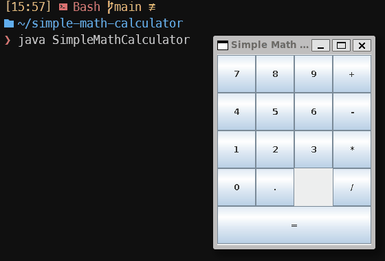

# Simple Math Calculator



A simple math calculator that performs binary operations.

## Getting started

To install this application, you can clone this repo

```bash
git clone https://github.com/renkr/simple-math-calculator
```

after that

```bash
cd simple-math-calculator
```

and then, compile and run !

**Linux**

```bash
javac SimpleMathCalculator.java && java SimpleMathCalculator
```

**Windows**

```bash
javac -encoding UTF-8 SimpleMathCalculator.java && java SimpleMathCalculator
```
